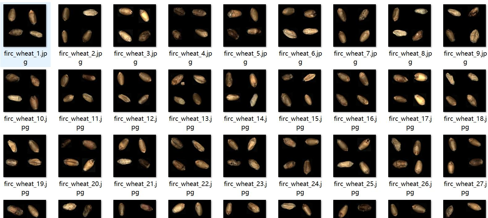
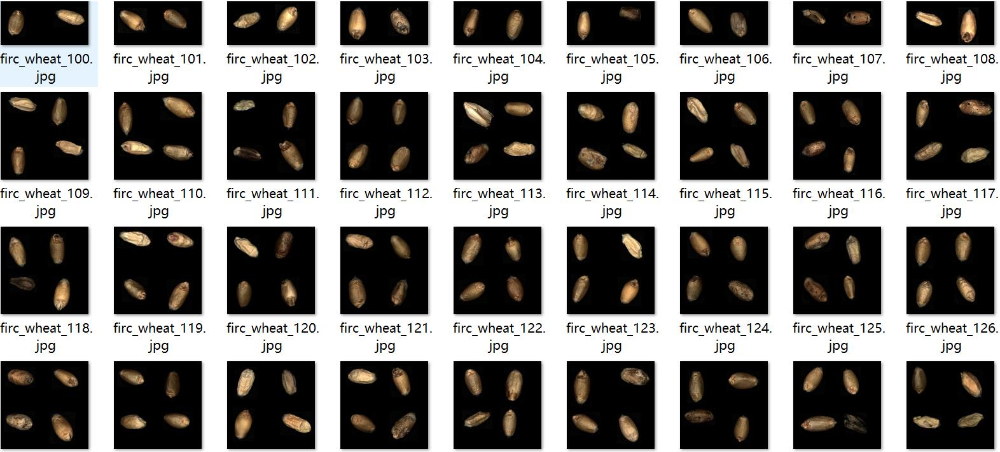
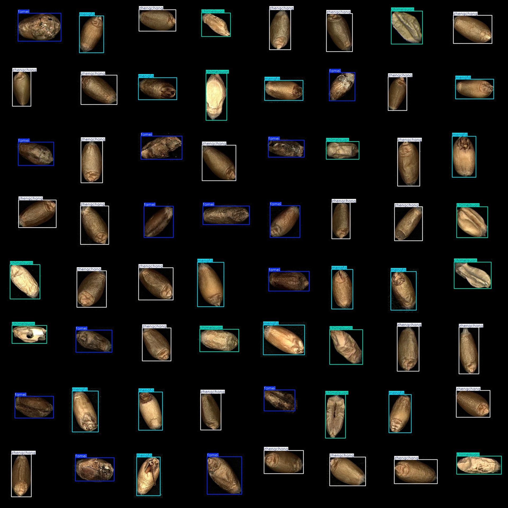
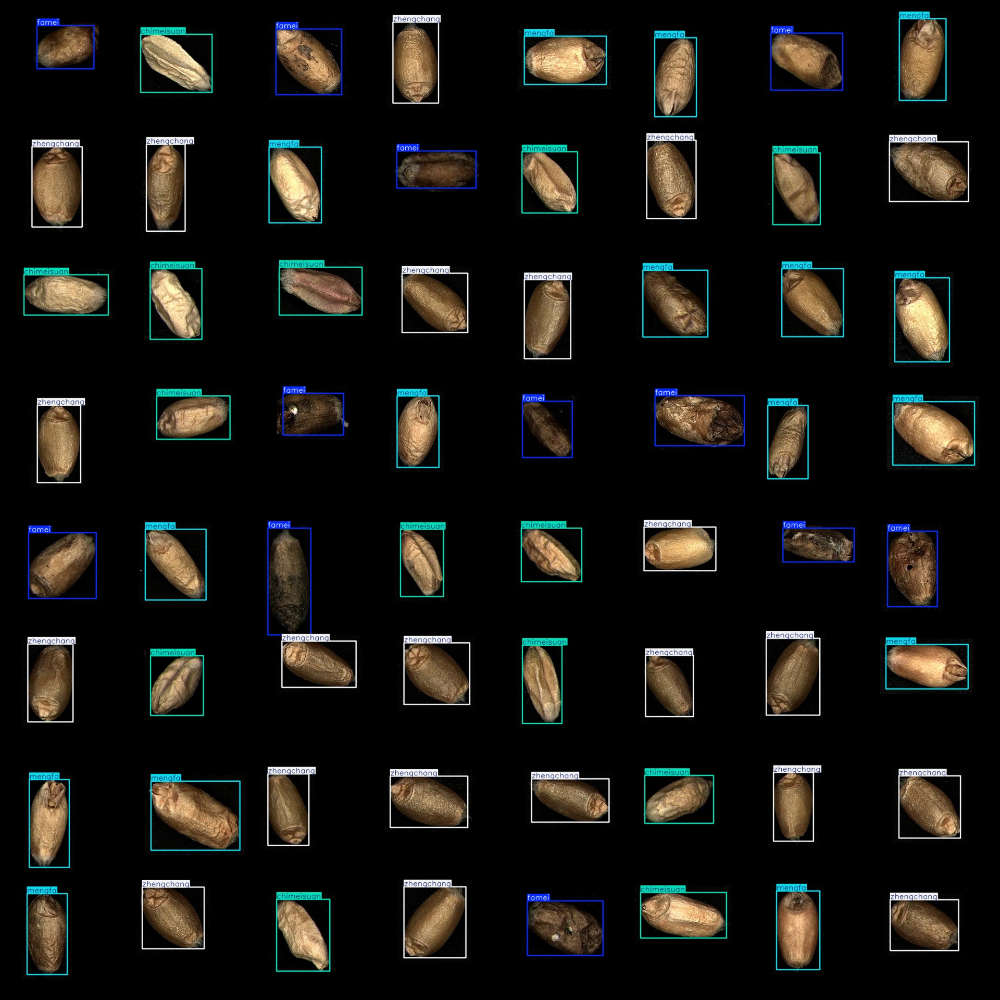

# Wheat Grain Quality Inspection and Wheat Grain Defects Data Set - VOC+YOLO Format, 1746 Images in 4 Categories

Dataset format: Pascal VOC format + YOLO format (without split paths in the txt file, only containing jpeg images and corresponding VOC format xml files and yolo format txt files)
Number of image files (jpeg files): 1746
Number of annotations (xml files): 1746
Number of annotations (txt files): 1746
Number of annotation categories: 4
Annotation category names (Note that the order of categories in the yolo format does not match this, but follows the order in the labels folder classes.txt): ["chimeisuan", "famei", "mengfa", 
"zhengchang"]
Number of boxes for each category: 
chimeisuan (Chloroform) boxes = 1832
famei (Mould) boxes = 1520
mengfa (Bud) boxes = 1583
zhengchang (Normal) boxes = 2043
Total boxes: 6978
Number of images per category: 
chimeisuan (Chloroform) images = 1203
famei (Mould) images = 1079
mengfa (Bud) images = 1098
zhengchang (Normal) images = 1318
Image resolution: 640x640
Annotation tool used: labelImg
Annotation rules: draw rectangles around categories
Important note: The dataset does not have a split into training, validation, or test sets; you should manually divide it.
Special notice: This dataset does not guarantee the accuracy of the trained model or weight files.
Image preview:
Annotation example:
## Images

Here is a pay link on Stripe ( https://buy.stripe.com/3cs8yP7sY87d0vu9AB ). Please contact me lonlonago@foxmail.com after funding $89, and I will send you a complete data files , thank you!

